# Spring 注解驱动开发

## 一、简介

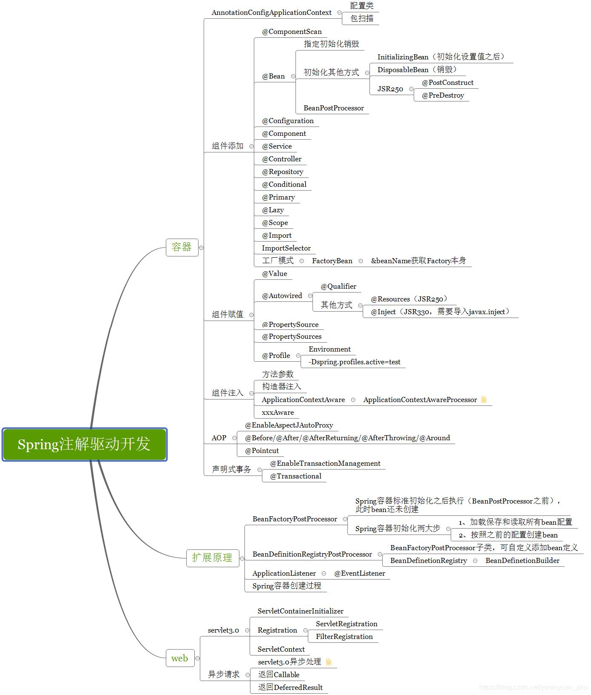


整个专栏分成了三个大的部分，分别是：容器、扩展原理以及Web。

###  1.1 容器

容器作为整个专栏的第一大部分，内容包括：

- AnnotationConfigApplicationContext
- 组件添加
- 组件赋值
- 组件注入
- AOP
- 声明式事务


### 2.1 扩展原理

扩展原理作为整个专栏的第二大部分，内容包括：

- BeanFactoryPostProcessor
- BeanDefinitionRegistryPostProcessor
- ApplicationListener
- Spring容器创建过程

在这部分，我们会一起来研究一下Spring的底层源码和运行流程，对于很多小伙伴来说，这部分的内容相当枯燥，甚至有种身体被掏空的感觉（哈哈），但是，这部分的内容一定要掌握，记住是一定要掌握哟😊，因为这是普通程序员进阶成为高级程序员的必经之路。

这部分内容对于深度学习Spring框架，起着非常重要的作用。小伙伴们在看这部分的文章时，一定要根据文章自己多动手调试调试Spring源码，这样对于Spring的理解才能更加深刻。

### 1.3 Web

Web作为整个专栏的第三大部分，内容包括：

- servlet3.0
- 异步请求


## 二、Bean

### 2.1 Spring IOC和DI

在Spring容器的底层，最重要的功能就是IOC和DI，也就是控制反转和依赖注入。

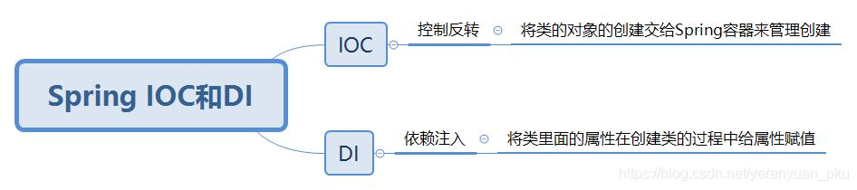

DI和IOC它俩之间的关系是DI不能单独存在，DI需要在IOC的基础上来完成。

在Spring内部，所有的组件都会放到IOC容器中，组件之间的关系通过IOC容器来自动装配，也就是我们所说的依赖注入。接下来，我们就使用注解的方式来完成容器中组件的注册、管理及依赖、注入等功能。

在介绍使用注解完成容器中组件的注册、管理及依赖、注入等功能之前，我们先来看看使用XML配置文件是如何注入bean的。

###  2.2 通过XML配置文件注入JavaBean

添加pom依赖包

```xml
<!-- https://mvnrepository.com/artifact/org.springframework/spring-context -->
<dependency>
    <groupId>org.springframework</groupId>
    <artifactId>spring-context</artifactId>
    <version>5.2.22.RELEASE</version>
</dependency>
```

创建bean下的People类

```java
public class Person {

    private String name;
    private Integer age;

    public Person(String name, Integer age) {
        this.name = name;
        this.age = age;
    }

    public Person() {
    }

    public String getName() {
        return name;
    }

    public void setName(String name) {
        this.name = name;
    }

    public Integer getAge() {
        return age;
    }

    public void setAge(Integer age) {
        this.age = age;
    }

    @Override
    public String toString() {
        return "Person{" +
                "name='" + name + '\'' +
                ", age=" + age +
                '}';
    }
}
```

在默认resource目录下创建Spring配置文件 beans.xml

```xml
<?xml version="1.0" encoding="UTF-8"?>
<beans xmlns="http://www.springframework.org/schema/beans"
       xmlns:xsi="http://www.w3.org/2001/XMLSchema-instance"
       xsi:schemaLocation="http://www.springframework.org/schema/beans http://www.springframework.org/schema/beans/spring-beans.xsd">

        <bean id="person" class="com.xiaotu.bean.Person">
            <property name="name" value="小土"></property>
            <property name="age" value="18"></property>
        </bean>
</beans>
```

随手创建一个测试类

```java
ApplicationContext applicationContext = new ClassPathXmlApplicationContext("beans.xml");
Person person = (Person)applicationContext.getBean("person");
System.out.println(person);
```

### 2.3 通过注解的方式注入JavaBean

在config下创建配置类 MainConfig

```java
@Configuration //告诉Spring这事一个配置类
public class MainConfig {

    //给容器注册一个Bean 类型返回值的类型 id默认方法名
    @Bean
    public Person person1(){
        return new Person("xiaotu2",20);
    }

}
```

测试类加载注解类

```java
ApplicationContext applicationContext = new AnnotationConfigApplicationContext(MainConfig.class);
Person person = applicationContext.getBean(Person.class);
System.out.println(person);
```

### 2.4 IOC容器中Bean的名字

- xml配置则为定义的id值

- java配置类则为@Bean注解下标识的方法名，若Bean注解有值，则为配置的值

```java
String[] name4Type = applicationContext.getBeanDefinitionNames();
for ( String name:name4Type){
	System.out.println(name);
}
```

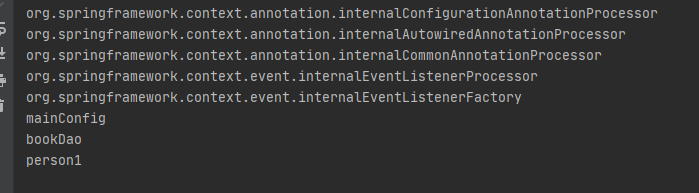


## 三、ComponentScan

### 3.1 XML文件扫描

```xml
<!--只要在com.xiaotu包下，或者com.meimeixia的子包下标注了@Repository、@Service、@Controller、@Component注解的类都会被扫描到，并自动注入到Spring容器中-->
<context:component-scan base-package="com.xiaotu"></context:component-scan>
```

新增BookController,BookService,BookDao文件，添加junit依赖

```java
@Test
public void testScan(){
    ApplicationContext applicationContext = new ClassPathXmlApplicationContext("beans.xml");
    String[] definitionNames = applicationContext.getBeanDefinitionNames();
    for ( String name:definitionNames){
        System.out.println(name);
    }
}
```


### 3.2 配置类注解扫描

```java
@ComponentScan(value = "com.xiaotu")
@Configuration //告诉Spring这事一个配置类
public class MainConfig {

    //给容器注册一个Bean 类型返回值的类型 id默认方法名
    //@Bean("person002")
    @Bean
    public Person person(){
        return new Person("xiaotu2",20);
    }

}
```


### 3.3 关于@ComponetScan注解

```java
ComponentScan.Filter[] includeFilters() default {};

ComponentScan.Filter[] excludeFilters() default {};
```

- excludeFilters 扫描时应该排除的类
- includeFilters 只扫描包含注解标注的类

```java
@ComponentScan(
        value = "com.xiaotu",
        excludeFilters = {
                @Filter( type = FilterType.ANNOTATION,classes = { Controller.class } ),
                @Filter( type = FilterType.ASSIGNABLE_TYPE , classes = { BookDao.class }),
        } )
```


配置includeFilters 并没有生效，需要增加useDefaultFilters = false 

```
@ComponentScan(
        value = "com.xiaotu",
        includeFilters = { @Filter( type = FilterType.ANNOTATION,classes = { Service.class } )},
        useDefaultFilters = false 
)
```

### 3.4 重复注解

```java
@ComponentScan(
        value = "com.xiaotu",
        includeFilters = { @Filter( type = FilterType.ANNOTATION,classes = { Service.class } )},
        useDefaultFilters = false
)
@ComponentScan(
        value = "com.xiaotu",
        includeFilters = { @Filter( type = FilterType.ANNOTATION,classes = { Controller.class } )},
        useDefaultFilters = false
)
```


## 四、自定义的TypeFilter

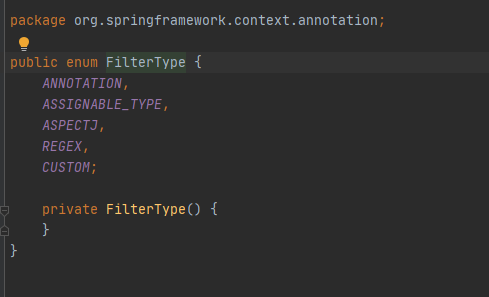


### 4.1 ANNOTATION

FilterType.ANNOTATION :按照注解进行包含或者排除

```java
@ComponentScan(
        value = "com.xiaotu",
        includeFilters = { @Filter( type = FilterType.ANNOTATION,classes = { Controller.class } )},
        useDefaultFilters = false
)
```


### 4.2 ASSIGNABLE_TYPE

FilterType.ASSIGNABLE_TYPE：按照给定的类型进行包含或者排除

```java
@ComponentScan(
        value = "com.xiaotu",
        includeFilters = { @Filter( type = FilterType.ASSIGNABLE_TYPE ,classes = {BookService.class} )  },
        useDefaultFilters = false
)
```


### 4.3 ASPECTJ

FilterType.ASPECTJ：按照ASPECTJ表达式进行包含或者排除

```java
@ComponentScan(
        value = "com.xiaotu",
        includeFilters = { @Filter( type = FilterType.ASPECTJ,classes = AspectJTypeFilter.class) },
        useDefaultFilters = false
)
```


### 4.4 REGEX

FilterType.REGEX：按照正则表达式进行包含或者排除

```java
@ComponentScan(
        value = "com.xiaotu",
        includeFilters = { @Filter( type = FilterType.ASPECTJ,classes = AspectJTypeFilter.class) },
        useDefaultFilters = false
)
```


### 4.5 CUSTOM

 FilterType.CUSTOM：按照自定义规则进行包含或者排除，必须为org.springframework.core.type.filter.TypeFilter接口的实现类


```java
public class MyTypeFilter implements TypeFilter {
    /**
     * 参数：
     * metadataReader:读取到的当前正在扫描的类的信息
     * metadataReaderFactory:可以获取到其他任何类的信息的（工厂）
     * */
    @Override
    public boolean match(MetadataReader metadataReader, MetadataReaderFactory metadataReaderFactory) throws IOException {
        return false;
    }

}
```


```java
@ComponentScan(
        value = "com.xiaotu",
        includeFilters = { @Filter( type = FilterType.CUSTOM,classes = MyTypeFilter.class) },
        useDefaultFilters = false
)
```


### 4.6 实现自定义过滤规则

```java
public class MyTypeFilter implements TypeFilter {
    /**
     * 参数：
     * metadataReader:读取到的当前正在扫描的类的信息
     * metadataReaderFactory:可以获取到其他任何类的信息的（工厂）
     * */
    @Override
    public boolean match(MetadataReader metadataReader, MetadataReaderFactory metadataReaderFactory) throws IOException {
        // 获取当前类注解的信息
        AnnotationMetadata annotationMetadata = metadataReader.getAnnotationMetadata();
        // 获取当前正在扫描的类的类信息 比如他的类型 实现的接口
        ClassMetadata classMetadata = metadataReader.getClassMetadata();
        // 获取当前类的资源信息 类的路径等信息
        Resource resource = metadataReader.getResource();
        // 获取正在扫描的类名
        String className =  classMetadata.getClassName();

        System.out.println("====>"+ className);
//        System.out.println("====>"+ annotationMetadata);
//        System.out.println("====>"+ classMetadata);
//        System.out.println("====>"+ resource);
        if (className.contains("er")){
            return true;
        }
        return false;
    }
}
```


## 五、@Scope注解

### 5.1 @注解概述


- ConfigurableBeanFactory#SCOPE_PROTOTYPE
- ConfigurableBeanFactory#SCOPE_SINGLETON
- org.springframework.web.context.WebApplicationContext#SCOPE_REQUEST
- org.springframework.web.context.WebApplicationContext#SCOPE_SESSION

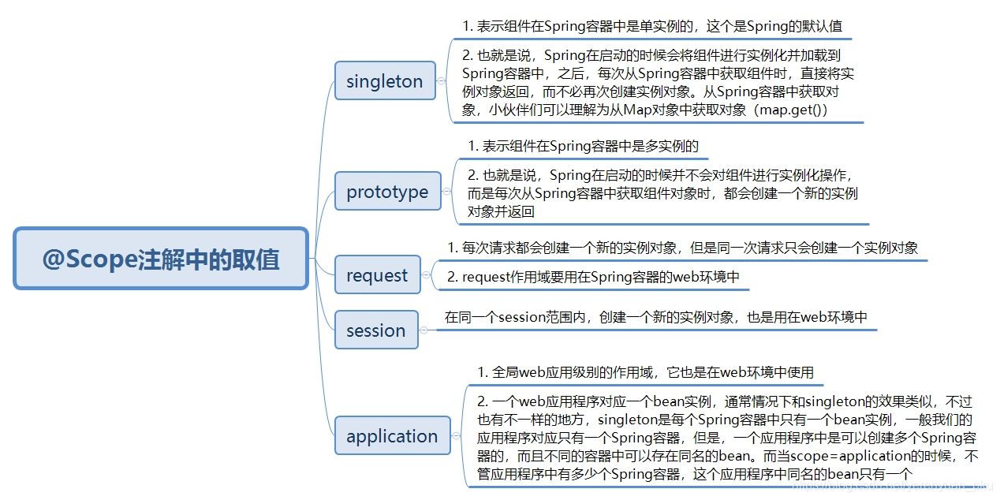

request和session的作用域需要web环境，也可以通过

```
request.setAttribute("key",Object);

session.setAttribute("key",Object);
```


### 5.2 单实例bean作用域

com.xiaotu.config包下创建一个配置类，例如MainConfig2，然后在该配置类中实例化一个Person对象，并将其放置在Spring容器中，如下所示。

```java
@Configuration
public class MainConfig2 {

    @Bean
    public Person person(){
        return new Person("theodore",18);
    }
}
```


IOCTest增加新的测试方法

```java
@Test
public void test02(){
    AnnotationConfigApplicationContext applicationContext = new AnnotationConfigApplicationContext(MainConfig2.class);

    //IOC默认的bean管理都是单例的，获取多次为同一个单例对象
    Person person = (Person) applicationContext.getBean("person");
    Person person2 = (Person) applicationContext.getBean("person");
    System.out.println(person == person2);
}
```

**对象在Spring容器中默认是单实例的，Spring容器在启动时就会将实例对象加载到Spring容器中，之后，每次从Spring容器中获取实例对象，都是直接将对象返回，而不必再创建新的实例对象了**。

### 5.3 多实例的bean作用域

修改bean作用域

```java
@Configuration
public class MainConfig2 {

    @Scope("prototype")
    @Bean
    public Person person(){
        return new Person("theodore",18);
    }
}
```


xml方式

```xml
<bean id="person" class="com.xiaotu.bean.Person" scope="prototype">
    <property name="name" value="小土"></property>
    <property name="age" value="18"></property>
</bean>
```

IOCTest中的test02返回false。


### 5.4 单实例bean作用域何时创建对象

去掉 ` @Scope("prototype")`， person实例化前增加打印`System.out.println("给容器中添加person对象");`

```java
@Test
public void test03(){
    AnnotationConfigApplicationContext applicationContext = new AnnotationConfigApplicationContext(MainConfig2.class);

}
```

运行test03发现打印代码，说明Spring容器在创建的时候，就将@Scope注解标注为singleton的组件进行了实例化，并加载到了Spring容器中。


### 5.5 多实例bean作用域何时创建对象

恢复 ` @Scope("prototype")`,运行test03，没有打印日志。在test03中添加获取bean。

```java
@Test
public void test03(){
    AnnotationConfigApplicationContext applicationContext = new AnnotationConfigApplicationContext(MainConfig2.class);
    Person person = (Person) applicationContext.getBean("person");

}
```

再次运行，出现了打印日志。


```java
@Test
public void test03(){
    AnnotationConfigApplicationContext applicationContext = new AnnotationConfigApplicationContext(MainConfig2.class);
    Person person = (Person) applicationContext.getBean("person");
    Person person2 = (Person) applicationContext.getBean("person");
    System.out.println(person == person2);
}
```

获取多个实例，两个实例并不相等

每次向Spring容器获取对象时，它都会创建一个新的对象并返回。


### 5.6 注意事项

**单实例bean是整个应用所共享的，所以需要考虑到线程安全问题，之前在玩SpringMVC的时候，SpringMVC中的Controller默认是单例的，有些开发者在Controller中创建了一些变量，那么这些变量实际上就变成共享的了，Controller又可能会被很多线程同时访问，这些线程并发去修改Controller中的共享变量，此时很有可能会出现数据错乱的问题，所以使用的时候需要特别注意。**

**多实例bean每次获取的时候都会重新创建，如果这个bean比较复杂，创建时间比较长，那么就会影响系统的性能，因此这个地方需要注意点。**


### 5.7 自定义Scope

- Scope源码

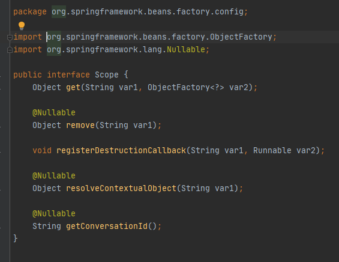

- 将自定义Scope注册到容器中。此时，需要调用org.springframework.beans.factory.config.ConfigurableBeanFactory#registerScope这个方法，咱们看一下这个方法的声明

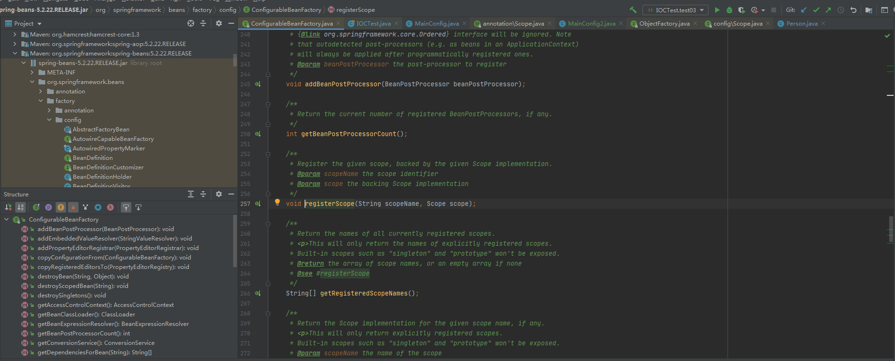

- 使用自定义的作用域。也就是在定义bean的时候，指定bean的scope属性为自定义的作用域名称

### 5.8 自定义Scope的实现案例

实现一个线程级别的bean作用域，同一个线程中同名的bean是同一个实例，不同的线程中的bean是不同的实例。

```java
public class ThreadScope implements Scope {
    public static final String THREAD_SCOPE = "thread";
    private ThreadLocal<Map<String,Object>> beanMap = new ThreadLocal(){

        @Override
        protected Object initialValue() {
            return new HashMap<>();
        }
    };

    
    
    /**
    * 返回当前作用域中的name对应的bean对象
    * @param name:需要检索的bean对象的名称
    * @param objectFactory :如果name对应的bean对象在当前作用域没有找到，则可以调用这个objectFactory来创建这个bean对象
    * */
    @Override
    public Object get(String name, ObjectFactory<?> objectFactory) {
        Object bean = beanMap.get().get(name);
        if (Objects.isNull(bean)){
            bean = objectFactory.getObject();
            beanMap.get().put(name,bean);
        }
        return null;
    }

    /**
    * 将name对应的bean对象从当前作用域中移除
    * */
    @Override
    public Object remove(String name) {
        return this.beanMap.get().remove(name);
    }

    /**
    * 用于注册销毁回调，若想要销毁相应的对象,则要由spring容器注册相应的销毁回调，而由自定义的作用域选择是不是要销毁相应的对象
    * */
    @Override
    public void registerDestructionCallback(String name, Runnable callback) {
        System.out.println(name);
    }

    /**
     * 用于解析相应的上下文数据，比如request作用域将返回request中的属性
     * */
    @Override
    public Object resolveContextualObject(String key) {
        return null;
    }

    /**
    *  作用域的会话标识，比如session作用域的会话标识是sessionID
    * */
    @Override
    public String getConversationId() {
        return Thread.currentThread().getName();
    }
}
```


新增MainConfig3

````java
@Configuration
public class MainConfig3 {

    @Scope("thread")
    @Bean("person")
    public Person person(){
        System.out.println("给容器添加person对象");
        return new Person("崔小土",21);
    }
}
````


新增测试方法

```java
@Test
public void test04(){
    AnnotationConfigApplicationContext applicationContext = new AnnotationConfigApplicationContext(MainConfig3.class);
    //向容器中注册自定义的scope
    applicationContext.getBeanFactory().registerScope(ThreadScope.THREAD_SCOPE,new ThreadScope());

    //使用容器获取bean
    for (int i = 0; i < 2; i++) {
        new Thread(()->{
            System.out.println(Thread.currentThread() + "," + applicationContext.getBean("person"));
            System.out.println(Thread.currentThread() + "," + applicationContext.getBean("person"));
        }).start();
    }

    try {
        TimeUnit.SECONDS.sleep(1);
    }catch (Exception e){
        e.printStackTrace();
    }
}
```

测试失败：啊哈哈哈 多线程获取不到bean! 不知道怎么实现的。todo：修复多进程获取bean的问题！！


## 六、懒加载

懒加载就是Spring容器启动的时候，先不创建对象，在第一次使用（获取）bean的时候再来创建对象，并进行一些初始化。

已知作用域为 singleton的时候会提前加载，prototype的时候本身就是获取时加载。所以懒加载只正对单例作用域模式。

```java
@Configuration
public class MainConfig2 {

    @Lazy
    @Bean
    public Person person(){
        System.out.println("给容器中添加person对象");
        return new Person("theodore",18);
    }
}
```


新增测试方法

```java
@Test
public void test05(){
    AnnotationConfigApplicationContext applicationContext = new AnnotationConfigApplicationContext(MainConfig2.class);

    //IOC默认的bean管理都是单例的，获取多次为同一个单例对象
    Person person = (Person) applicationContext.getBean("person");
    Person person2 = (Person) applicationContext.getBean("person");
    System.out.println(person == person2);
}
```

懒加载，也称延时加载，仅针对单实例bean生效。 单实例bean是在Spring容器启动的时候加载的，添加@Lazy注解后就会延迟加载，在Spring容器启动的时候并不会加载，而是在第一次使用此bean的时候才会加载，但当你多次获取bean的时候并不会重复加载，只是在第一次获取的时候才会加载，这不是延迟加载的特性，而是单实例bean的特性。


## 七、@Import注解

（@Controller、@Servcie、@Repository、@Component）注解可以给自己写的类定义为bean组件，但是对于三方引入包的类，无法使用上述注解。

### 7.1 注册bean的方式

1. 包扫描+给组件标注注解（@Controller、@Servcie、@Repository、@Component）
2. @Bean注解，通常用于导入第三方包中的组件
3. @Import注解，快速向spring容器中导入一个组件
4. 使用Spring提供的FactoryBean（工厂Bean）
   - 默认获取到的是工厂bean本身调用的getObject创建对象
   - 要获取工厂bean本身对象，我们要在id加个&

### 7.2 @Import注解概述

Spring 3.0之前，创建bean可以通过XML配置文件与扫描特定包下面的类来将类注入到Spring IOC容器内。而在Spring 3.0之后提供了JavaConfig的方式，也就是将IOC容器里面bean的元信息以Java代码的方式进行描述，然后我们可以通过@Configuration与@Bean这两个注解配合使用来将原来配置在XML文件里面的bean通过Java代码的方式进行描述。

@Import注解提供了@Bean注解的功能，同时还有XML配置文件里面标签组织多个分散的XML文件的功能，当然在这里是组织多个分散的@Configuration，因为一个配置类就约等于一个XML配置文件。

我们先看一下@Import注解的源码，如下所示。

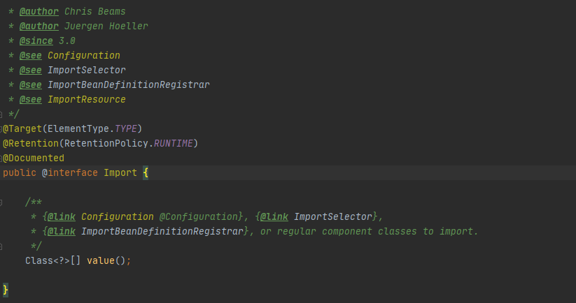

**注意：@Import注解只允许放到类上面，不允许放到方法上。**

### 7.3 @Import注解的使用方法

1. 直接写class数组的方式
2. **ImportSelector接口的方式，批量导入**
3. ImportBeanDefinitionRegistrar接口方式，既手工注册bean到容器中


### 7.4 导入示例1  @Import

- 在bean下新建Color和Red类，在MainConfig2类上增加注解

```java
@Import(Color.class)

@Import({Color.class, Red.class})
```


### 7.5 导入示例2  ImportSelector

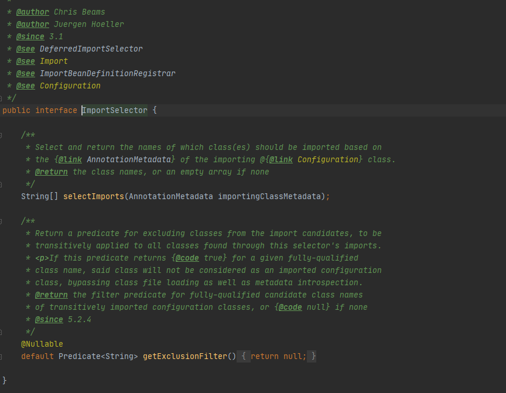

其主要作用是收集需要导入的配置类，selectImports()方法的返回值就是我们向Spring容器中导入的类的全类名。如果该接口的实现类同时实现EnvironmentAware，BeanFactoryAware，BeanClassLoaderAware或者ResourceLoaderAware，那么在调用其selectImports()方法之前先调用上述接口中对应的方法，如果需要在所有的@Configuration处理完再导入时，那么可以实现DeferredImportSelector接口。

在ImportSelector接口的selectImports()方法中，存在一个AnnotationMetadata类型的参数，这个参数能够获取到当前标注@Import注解的类的所有注解信息，也就是说不仅能获取到@Import注解里面的信息，还能获取到其他注解的信息。

```java
public class MyImportSelector implements ImportSelector {

    /**
     * 返回值：就是导入到容器中的组件的全类名
     * AnnotationMetadata:当前标注@Import注解的类的所有注解信息，
     * */
    @Override
    public String[] selectImports(AnnotationMetadata importingClassMetadata) {
        //不能返回null 否则会引起空指针报错
        return new String[]{};
    }
}
```

在bean下新建Bule类和Yellow类,修改MyImportSelector返回

```java
   @Override
    public String[] selectImports(AnnotationMetadata importingClassMetadata) {
        //不能返回null 否则会引起空指针报错
        return new String[]{"com.xiaotu.bean.Blue","com.xiaotu.bean.Yellow"};
    }
```


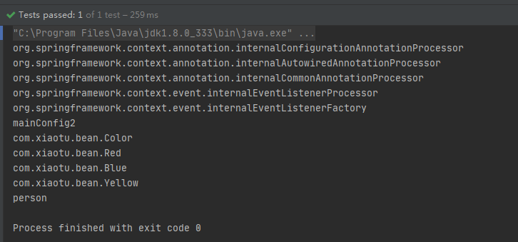


### 7.5  导入示例3 ImportBeanDefinitionRegistrar

ImportBeanDefinitionRegistrar本质上是一个接口。在ImportBeanDefinitionRegistrar接口中，有一个registerBeanDefinitions()方法，通过该方法，我们可以向Spring容器中注册bean实例。

Spring官方在动态注册bean时，大部分套路其实是使用ImportBeanDefinitionRegistrar接口

所有实现了该接口的类都会被ConfigurationClassPostProcessor处理，ConfigurationClassPostProcessor实现了BeanFactoryPostProcessor接口，所以ImportBeanDefinitionRegistrar中动态注册的bean是优先于依赖其的bean初始化的，也能被aop、validator等机制处理。

使用方法
ImportBeanDefinitionRegistrar需要配合@Configuration和@Import这俩注解，其中，@Configuration注解定义Java格式的Spring配置文件，@Import注解导入实现了ImportBeanDefinitionRegistrar接口的类。


创建一个MyImportBeanDefinitionRegistrar类，去实现ImportBeanDefinitionRegistrar接口

```java
public class MyImportBeanDefinitionRegistrar implements ImportBeanDefinitionRegistrar {

    /**
     * AnnotationMetadata : 当前类的注解信息
     * BeanDefinitionRegistry : BeanDefinition注册类
     *
     * 我们可以通过调用BeanDefinitionRegistry接口中的registerBeanDefinition方法，
     * 手动注册所有需要添加到容器中的bean
     * */
    @Override
    public void registerBeanDefinitions(AnnotationMetadata importingClassMetadata, BeanDefinitionRegistry registry) {
        boolean definition1 = registry.containsBeanDefinition("com.xiaotu.bean.Blue");
        boolean definition2 = registry.containsBeanDefinition("com.xiaotu.bean.Red");
        if (definition1 && definition2){
            // 指定bean的定义信息,包括bean的类型、作用域等
            // RootBeanDefinition是BeanDefinition的一个实现类
            RootBeanDefinition beanDefinition = new RootBeanDefinition(RainBow.class);
            // 注册一个bean,并指定bean的名称
            registry.registerBeanDefinition("rainBow",beanDefinition);
        }
    }
}
```


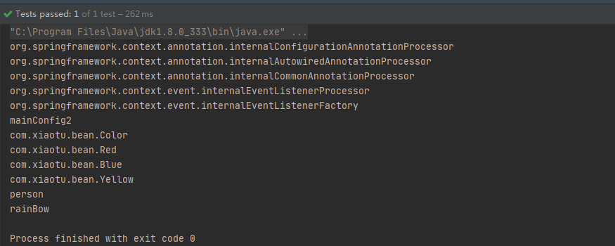


## 八、FactoryBean

### 8.1 FactoryBean概述

一般情况下，Spring是通过反射机制利用bean的class属性指定实现类来实例化bean的。在某些情况下，实例化bean过程比较复杂，如果按照传统的方式，那么则需要在标签中提供大量的配置信息，配置方式的灵活性是受限的，这时采用编码的方式可以得到一个更加简单的方案。Spring为此提供了一个org.springframework.bean.factory.FactoryBean的工厂类接口，用户可以通过实现该接口定制实例化bean的逻辑。

FactoryBean接口对于Spring框架来说占有非常重要的地位，Spring自身就提供了70多个FactoryBean接口的实现。它们隐藏了实例化一些复杂bean的细节，给上层应用带来了便利。从Spring 3.0开始，FactoryBean开始支持泛型，即接口声明改为FactoryBean<T>的形式。


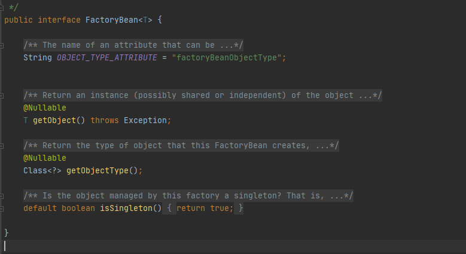

- getObject: 返回由FactoryBean创建的bean实例，如果isSingleton()返回true,那么该实例会放到Spring容器中单实例缓存池中。
- boolean isSingleton():返回FactoryBean创建的bean实例的作用域是singleton还是prototype
- Class<?> getObjectType():返回FactoryBean创建的bean实例的类型

当配置文件中标签的class属性配置的实现类是FactoryBean时，通过 getBean()方法返回的不是FactoryBean本身，而是FactoryBean#getObject()方法所返回的对象，相当于FactoryBean#getObject()代理了getBean()方法。


### 8.2 FactoryBean案例

```java
public class ColorFactoryBean implements FactoryBean {

    @Override
    public boolean isSingleton() {
        return false;
    }

    //返回color对象，这个对象添加到容器中
    @Override
    public Object getObject() throws Exception {
        return new Color();
    }

    @Override
    public Class<?> getObjectType() {
        return Color.class;
    }
}
```

MainConfig2配置类中加入ColorFactoryBean

```java
 @Bean
 public ColorFactoryBean colorFactoryBean(){
 	return new ColorFactoryBean();
 }
```

测试方法

```java
@Test
public void testImport3(){
    AnnotationConfigApplicationContext applicationContext = new AnnotationConfigApplicationContext(MainConfig2.class);
    Object bean = applicationContext.getBean("&colorFactoryBean");
    System.out.println("bean的类型：" +  bean.getClass());
}

@Test
public void testImport2(){
    AnnotationConfigApplicationContext applicationContext = new AnnotationConfigApplicationContext(MainConfig2.class);
    Object bean = applicationContext.getBean("colorFactoryBean");
    System.out.println("bean的类型：" +  bean.getClass());
}

@Test
public void testImport(){
    AnnotationConfigApplicationContext applicationContext = new AnnotationConfigApplicationContext(MainConfig2.class);
    String[] definitionNames = applicationContext.getBeanDefinitionNames();
    for (String name : definitionNames) {
        System.out.println(name);
    }
}
```


**获取工厂Bean本身时，在id前面加上&符号即可，例如&colorFactoryBean。**


## 九、@Bean注解指定初始化和销毁

### 9.1 XML配置

```xml
<bean id="person" class="com.xiaotu.bean.Car" scope="prototype" init-method="init" destroy-method="destroy">
</bean>
```


### 9.2 类配置

新建bean下car类

```java
public class Car {
    public Car() {
        System.out.println("car ... constructor ...");
    }

    public void init(){
        System.out.println("car ... init ...");
    }

    public void destroy(){
        System.out.println("car ... destroy ...");
    }
}
```

新建配置类MainConfigOfLifeCycle

```java
@Configuration
public class MainConfigOfLifeCycle {

    @Bean
    public Car car(){
        return new Car();
    }

}
```

新建测试类 IOCTest_LifeCycle

```java
public class IOCTest_LifeCycle {

    @Test
    public void test01(){
        AnnotationConfigApplicationContext applicationContext = new AnnotationConfigApplicationContext(MainConfigOfLifeCycle.class);
        System.out.println("容器创建完成");
    }

}
```

测试结果

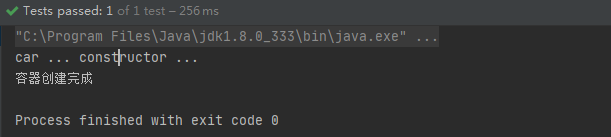

总结

对于单实例的bean,Spring容器启动时创建对象，多实例的bean，会在每次获取bean的时候创建对象。

### 9.3 源码分析

打开bean注解，initMethod属性和destroyMethod属性来指定bean的初始化方法和销毁方法。

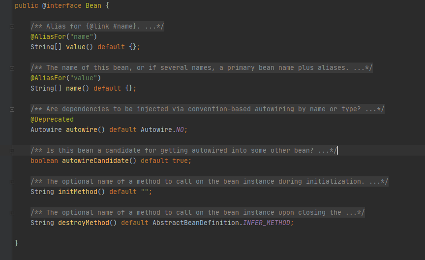


配置类增加

```java
@Bean(initMethod = "init",destroyMethod = "destroy")
public Car car(){
    return new Car();
}
```

再次运行测试方法，返回结果

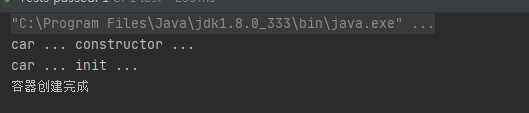

容器销毁时，会调用销毁方法

```java
    @Test
    public void test01(){
        AnnotationConfigApplicationContext applicationContext = new AnnotationConfigApplicationContext(MainConfigOfLifeCycle.class);
        System.out.println("容器创建完成");

        applicationContext.close();
    }
```


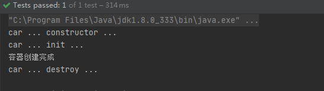

### 9.4 初始化和销毁方法调用的时机
你有没有想过这样一个问题，初始化方法和销毁方法是在什么时候被调用的啊？

- bean对象的初始化方法调用的时机：对象创建完成，如果对象中存在一些属性，并且这些属性也都赋好值之后，那么就会调用bean的初始化方法。对于单实例bean来说，在Spring容器创建完成后，Spring容器会自动调用bean的初始化方法；对于多实例bean来说，在每次获取bean对象的时候，调用bean的初始化方法。
- bean对象的销毁方法调用的时机：对于单实例bean来说，在容器关闭的时候，会调用bean的销毁方法；对于多实例bean来说，Spring容器不会管理这个bean，也就不会自动调用这个bean的销毁方法了。不过，小伙伴们可以手动调用多实例bean的销毁方法。


## 十、InitializingBean和DisposableBean

### 10.1 InitializingBean接口概述

org.springframework.beans.factory;下InitializingBean

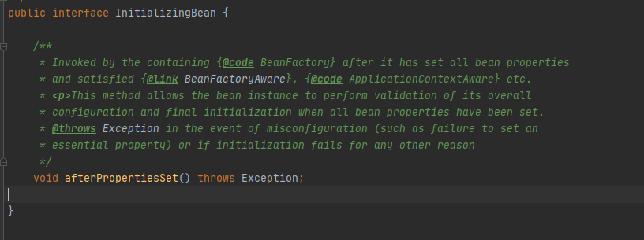

org.springframework.beans.factory.support.AbstractAutowireCapableBeanFactory这个类里面的invokeInitMethods()方法中

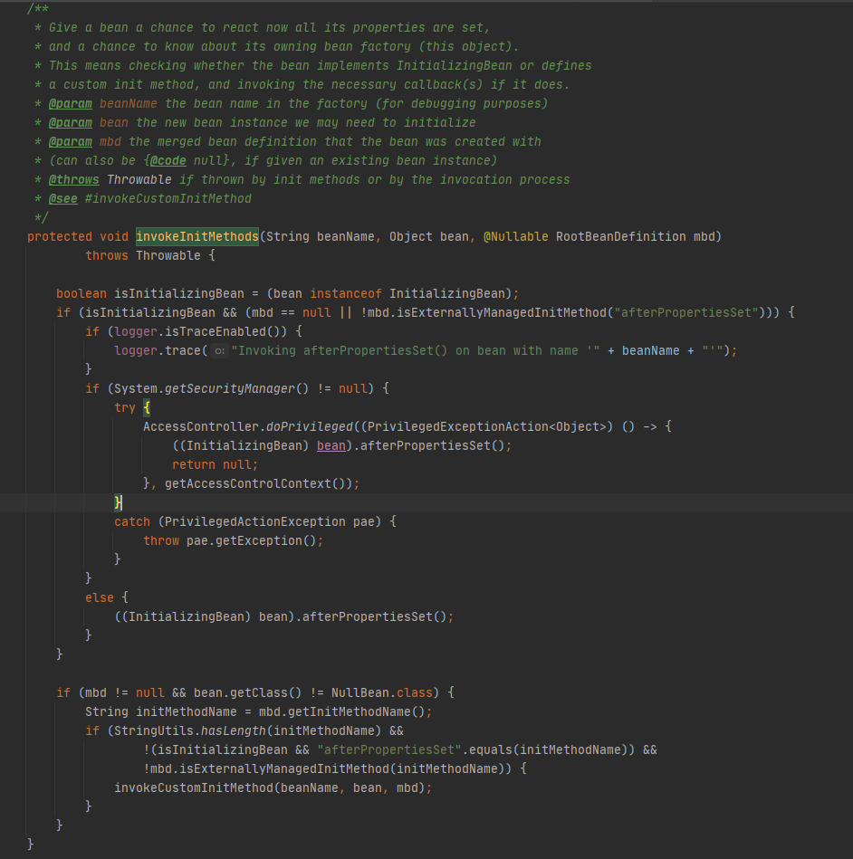

1. Spring为bean提供了两种初始化的方式，实现InitializingBean接口（也就是要实现该接口中的afterPropertiesSet方法），或者在配置文件或@Bean注解中通过init-method来指定，两种方式可以同时使用。

2. 实现InitializingBean接口是直接调用afterPropertiesSet()方法，与通过反射调用init-method指定的方法相比，效率相对来说要高点。但是init-method方式消除了对Spring的依赖。
   如果调用afterPropertiesSet方法时出错，那么就不会调用init-method指定的方法了。
   也就是说Spring为bean提供了两种初始化的方式，第一种方式是实现InitializingBean接口（也就是要实现该接口中的afterPropertiesSet方法），第二种方式是在配置文件或@Bean注解中通过init-method来指定，这两种方式可以同时使用，同时使
3. 先调用afterPropertiesSet方法，后执行init-method指定的方法。

也就是说Spring为bean提供了两种初始化的方式，第一种方式是实现InitializingBean接口（也就是要实现该接口中的afterPropertiesSet方法），第二种方式是在配置文件或@Bean注解中通过init-method来指定，这两种方式可以同时使用，同时使用先调用afterPropertiesSet方法，后执行init-method指定的方法。


### 10.2 DisposableBean接口


实现org.springframework.beans.factory.DisposableBean接口的bean在销毁前，Spring将会调用DisposableBean接口的destroy()方法。也就是说我们可以实现DisposableBean这个接口来定义咱们这个销毁的逻辑。

DisposableBean接口注意事项
多实例bean的生命周期不归Spring容器来管理，这里的DisposableBean接口中的方法是由Spring容器来调用的，所以如果一个多实例bean实现了DisposableBean接口是没有啥意义的，因为相应的方法根本不会被调用，当然了，在XML配置文件中指定了destroy方法，也是没有任何意义的。所以，在多实例bean情况下，Spring是不会自动调用bean的销毁方法的。


### 10.3 单实例案例

创建新的cat类实现InitializingBean和DisposableBean俩接口。

```java
@Component
public class Cat implements InitializingBean, DisposableBean {

    public Cat() {
        System.out.println("Cat...constructor...");
    }

    @Override
    public void destroy() throws Exception {
        System.out.println("Cat...destroy...");
    }

    @Override
    public void afterPropertiesSet() throws Exception {
        System.out.println("Cat...afterPropertiesSet...");
    }
}
```

MainConfigOfLifeCycle增加扫描组件

```java
@ComponentScan("com.xiaotu.bean")
```

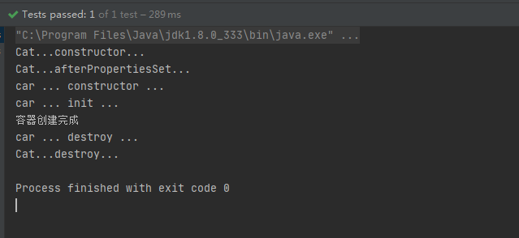

## 十一、@PostConstruct注解和@PreDestroy

### @PreDestroy注解

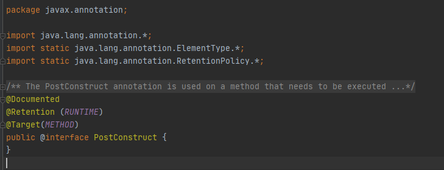

PostConstruct注解是Java中的注解，并不是Spring提供的注解。

@PostConstruct注解被用来修饰一个非静态的void()方法。被@PostConstruct注解修饰的方法会在服务器加载Servlet的时候运行，并且只会被服务器执行一次。被@PostConstruct注解修饰的方法通常在构造函数之后，init()方法之前执行。

通常我们是会在Spring框架中使用到@PostConstruct注解的，该注解的方法在整个bean初始化中的执行顺序如下：

> Constructor（构造方法）→@Autowired（依赖注入）→@PostConstruct（注释的方法）

### @PreDestroy注解

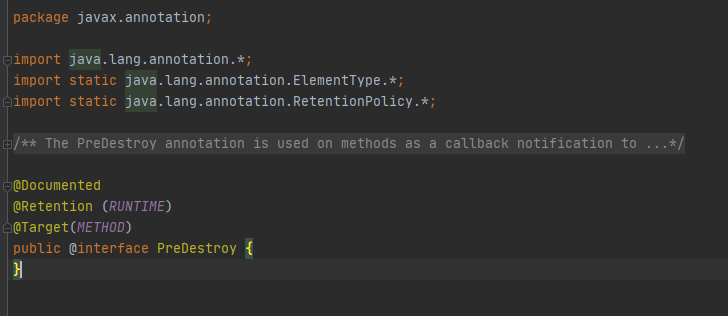

被@PreDestroy注解修饰的方法会在服务器卸载Servlet的时候运行，并且只会被服务器调用一次，类似于Servlet的destroy()方法。被@PreDestroy注解修饰的方法会在destroy()方法之后，Servlet被彻底卸载之前执行。执行顺序如下所示：

> 调用destroy()方法→@PreDestroy→destroy()方法→bean销毁


@PostConstruct和@PreDestroy是Java规范JSR-250引入的注解，定义了对象的创建和销毁工作，同一期规范中还有@Resource注解，Spring也支持了这些注解。

### 案例

```java
@Component
public class Dog {

    public Dog() {
        System.out.println("dog...constructor");
    }

    @PostConstruct
    public void init(){
        System.out.println("dog...PostConstruct");
    }

    @PreDestroy
    public void destroy(){
        System.out.println("dog...PreDestroy");
    }

}
```


## 十二、BeanPostProcessor


示例：

```java
package com.xiaotu.bean;

import org.springframework.beans.BeansException;
import org.springframework.beans.factory.config.BeanPostProcessor;
import org.springframework.stereotype.Component;

@Component
public class MyBeanPostProcessor implements BeanPostProcessor {
    @Override
    public Object postProcessBeforeInitialization(Object bean, String beanName) throws BeansException {
        System.out.println("postProcessBeforeInitialization ===>"+beanName+"===>"+bean);
        return bean;
    }

    @Override
    public Object postProcessAfterInitialization(Object bean, String beanName) throws BeansException {
        System.out.println("postProcessAfterInitialization ===>"+beanName+"===>"+bean);
        return bean;
    }
}

```


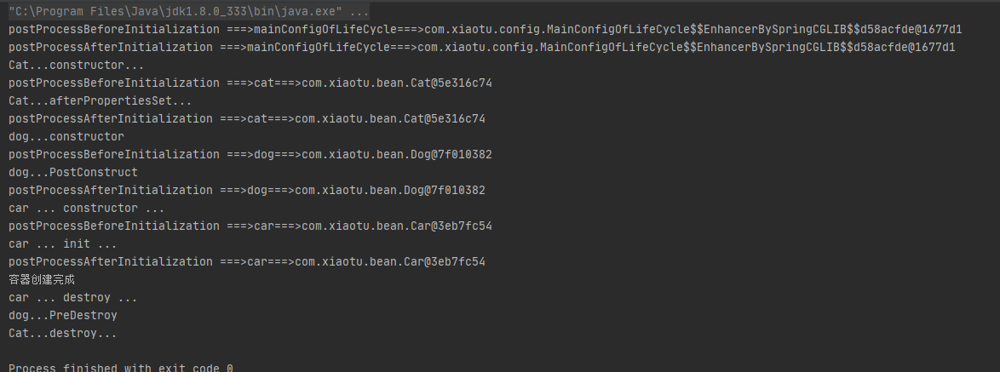


BeanPostProcessor后置处理器作用
后置处理器可用于bean对象初始化前后进行逻辑增强。Spring提供了BeanPostProcessor接口的很多实现类，例如AutowiredAnnotationBeanPostProcessor用于@Autowired注解的实现，AnnotationAwareAspectJAutoProxyCreator用于Spring AOP的动态代理等等。

除此之外，我们还可以自定义BeanPostProcessor接口的实现类，在其中写入咱们需要的逻辑。下面我会以AnnotationAwareAspectJAutoProxyCreator为例，简单说明一下后置处理器是怎样工作的。

我们都知道spring AOP的实现原理是动态代理，最终放入容器的是代理类的对象，而不是bean本身的对象，那么Spring是什么时候做到这一步的呢？就是在AnnotationAwareAspectJAutoProxyCreator后置处理器的postProcessAfterInitialization方法中，即bean对象初始化完成之后，后置处理器会判断该bean是否注册了切面，若是，则生成代理对象注入到容器中。这一部分的关键代码是在哪儿呢？我们定位到AbstractAutoProxyCreator抽象类中的postProcessAfterInitialization方法处便能看到了，如下所示。


### BeanPostProcessor的执行流程

bean的初始化和销毁
我们知道BeanPostProcessor的postProcessBeforeInitialization()方法是在bean的初始化之前被调用；而postProcessAfterInitialization()方法是在bean初始化的之后被调用。并且bean的初始化和销毁方法我们可以通过如下方式进行指定。

1. 通过@Bean指定init-method和destroy-method
2. 通过让bean实现InitializingBean和DisposableBean这俩接口
3. 使用JSR-250规范里面定义的@PostConstruct和@PreDestroy这俩注解
4. 通过让bean实现BeanPostProcessor接口


bean的实例化：调用bean的构造方法，我们可以在bean的无参构造方法中执行相应的逻辑。
bean的初始化：在初始化时，可以通过BeanPostProcessor的postProcessBeforeInitialization()方法和postProcessAfterInitialization()方法进行拦截，执行自定义的逻辑；通过@PostConstruct注解、InitializingBean和init-method来指定bean初始化前后执行的方法，在该方法中咱们可以执行自定义的逻辑。
bean的销毁：可以通过@PreDestroy注解、DisposableBean和destroy-method来指定bean在销毁前执行的方法，在该方法中咱们可以执行自定义的逻辑。


### BeanPostProcessor源码解析

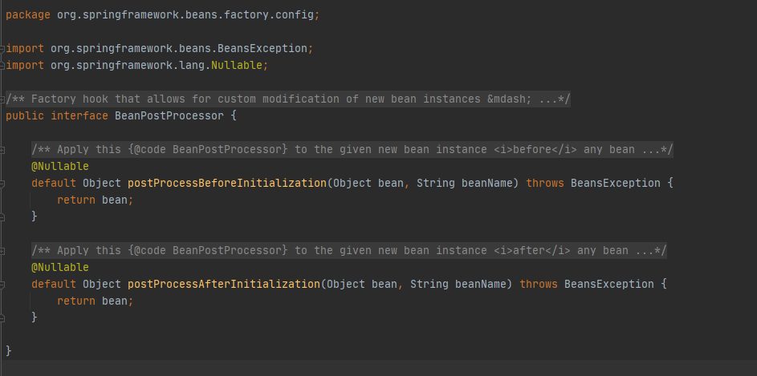


### ApplicationContextAwareProcessor类

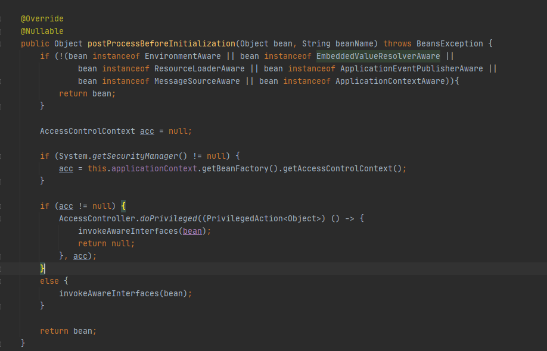


一个Dog类，使其实现ApplicationContextAware接口，此时，我们需要实现ApplicationContextAware接口中的setApplicationContext()方法，在setApplicationContext()方法中有一个ApplicationContext类型的参数，这个就是IOC容器对象，我们可以在Dog类中定义一个ApplicationContext类型的成员变量，然后在setApplicationContext()方法中为这个成员变量赋值，此时就可以在Dog类中的其他方法中使用ApplicationContext对象了，如下所示

```java
@Component
public class Dog implements ApplicationContextAware {
    private ApplicationContext applicationContext;

    public Dog() {
        System.out.println("dog...constructor");
    }

    @PostConstruct
    public void init(){
        System.out.println("dog...PostConstruct");
    }

    @PreDestroy
    public void destroy(){
        System.out.println("dog...PreDestroy");
    }

    @Override
    public void setApplicationContext(ApplicationContext applicationContext) throws BeansException {
        this.applicationContext = applicationContext;
    }
}
```

BeanPostProcessor在Spring底层的一种使用场景。至于上面的案例代码为何会在setApplicationContext()方法中获取到ApplicationContext对象，这就是ApplicationContextAwareProcessor类的功劳了！


### BeanValidationPostProcessor类

org.springframework.validation.beanvalidation.BeanValidationPostProcessor类主要是用来为bean进行校验操作的，当我们创建bean，并为bean赋值后，我们可以通过BeanValidationPostProcessor类为bean进行校验操作。BeanValidationPostProcessor类的源码如下所示。


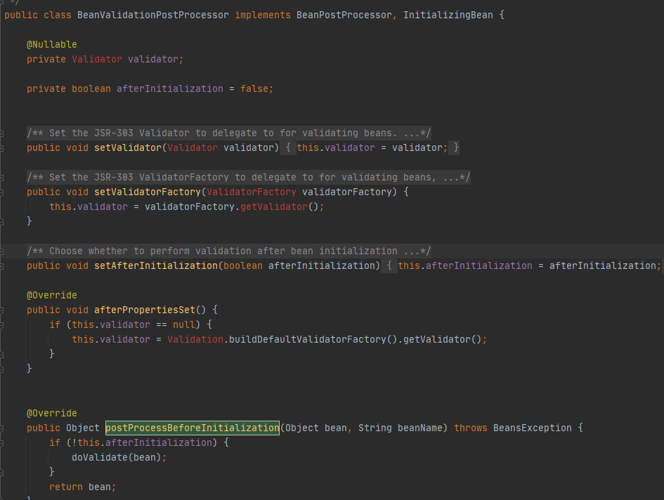


可以看到，在postProcessBeforeInitialization()方法和postProcessAfterInitialization()方法中的主要逻辑都是调用doValidate()方法对bean进行校验，只不过在这两个方法中都会对afterInitialization这个boolean类型的成员变量进行判断，若afterInitialization的值为false，则在postProcessBeforeInitialization()方法中调用doValidate()方法对bean进行校验；若afterInitialization的值为true，则在postProcessAfterInitialization()方法中调用doValidate()方法对bean进行校验。

### InitDestroyAnnotationBeanPostProcessor类

org.springframework.beans.factory.annotation.InitDestroyAnnotationBeanPostProcessor类主要用来处理@PostConstruct注解和@PreDestroy注解。

Spring怎么就能定位到使用@PostConstruct注解标注的方法呢？通过分析方法的调用栈，我们发现在进入使用@PostConstruct注解标注的方法之前，Spring调用了InitDestroyAnnotationBeanPostProcessor类的postProcessBeforeInitialization()方法，如下所示


AutowiredAnnotationBeanPostProcessor类
org.springframework.beans.factory.annotation.AutowiredAnnotationBeanPostProcessor类主要是用于处理标注了@Autowired注解的变量或方法。

Spring为何能够自动处理标注了@Autowired注解的变量或方法，就交给小伙伴们自行分析了。大家可以写一个测试方法并通过方法调用堆栈来分析AutowiredAnnotationBeanPostProcessor类的源码，从而找到自己想要的答案。


## 十三、@Value


### @Value注解的用法

不通过配置文件注入属性的情况

- 注入普通字符串

  ```java
  @Value("小土")
  private String name;
  ```

- 注入操作系统属性

  ```java
  @Value("#{systemProperties['os.name']}")
  private String systemPropertiesName;
  ```

- 注入SpEL表达式结果

  ```java
  @Value("#{ T(java.lang.Math).random()*100.0 }")
  private double randomNumber;//
  ```

- 注入其他bean中属性的值

  ```java
  @Value("#{ person.name }")
  private String username;
  ```

- 注入文件资源

  ```java
  @Value("class:/config.properties")
  private Resource resourceFile;
  ```

- 注入URL资源

  ```java
  @Value("http://www.baidu.com")
  private Resource url;
  ```


## 十四、自动装配

1. 默认优先按照类型去容器中找对应的组件：`applicationContext.getBean(BookDao.class);`

2. 如果找到多个相同类型的组件，再将属性的名称作为组件的ID去容器中查找：`applicationContext.getBean("bookDao1");`

3.  @Qualifier("bookDao") 指定需要装配的组件ID，而不是使用属性名

   ```java
   BookService{
       @Qualifier("bookDao")
       @Autowired(required=false)
       private BookDao bookDao1;
   }
   ```

4. 自动装配一定要将属性赋值好，如果容器中没有指定的类，就会报错。可以指定@Autowired(required=false)避免报错。

5. @Primary：让Spring进行自动装配的时候，默认使用首选的Bean。也可以使用@Qualifier来指定需要装配的Bean的名字。


配置新的配置类

```java
@Configuration
@PropertySource("classpath:/jdbc_config.properties")
public class MainConfigOfProfile implements EmbeddedValueResolverAware {

    @Value("${db.user}")
    private String user;

    private String driverClass;


    @Profile("test")
    @Bean
    public Yellow yellow(){
        return new Yellow();
    }

    @Profile("test")
    @Bean("testDataSource")
    public DataSource dataSourceTest(@Value("${db.password}") String password) throws PropertyVetoException {
        ComboPooledDataSource dataSource = new ComboPooledDataSource();
        dataSource.setUser(user);
        dataSource.setPassword(password);
        dataSource.setDriverClass(driverClass);
        dataSource.setJdbcUrl("jdbc:mysql://localhost:3306/test");
        return dataSource;
    }

    @Profile("dev")
    @Bean("devDataSource")
    public DataSource dataSourceDev(@Value("${db.password}") String password) throws PropertyVetoException {
        ComboPooledDataSource dataSource = new ComboPooledDataSource();
        dataSource.setUser(user);
        dataSource.setPassword(password);
        dataSource.setDriverClass(driverClass);
        dataSource.setJdbcUrl("jdbc:mysql://localhost:3306/test");
        return dataSource;
    }

    @Profile("prod")
    @Bean("prodDataSource")
    public DataSource dataSourceProd(@Value("${db.password}") String password) throws PropertyVetoException {
        ComboPooledDataSource dataSource = new ComboPooledDataSource();
        dataSource.setUser(user);
        dataSource.setPassword(password);
        dataSource.setDriverClass(driverClass);
        dataSource.setJdbcUrl("jdbc:mysql://localhost:3306/test");
        return dataSource;
    }

    @Override
    public void setEmbeddedValueResolver(StringValueResolver resolver) {
        driverClass = resolver.resolveStringValue("${db.driverClass}");

    }
}
```


测试方法

```JAVA
    @Test
    public void test01(){
        AnnotationConfigApplicationContext applicationContext = new AnnotationConfigApplicationContext();
        applicationContext.getEnvironment().setActiveProfiles("dev","test");
        applicationContext.register(MainConfigOfProfile.class);
        applicationContext.refresh();

        String[] names = applicationContext.getBeanDefinitionNames();
        for (String name : names){
            System.out.println(name);
        }
    }
```


## 十五、AOP 动态代理

指在程序运行期间动态的将某段代码切入到指定方法指定位置进行运行的编程方式；


三步:

1)、将业务逻辑组件和切面类都加入到容器中;告诉Spring哪个是切面类(@Aspect)

2)、在切面类上的每一个通知方法上标注通知注解，告诉Spring何时何地运行(切入点表达式)

3)、开启基于注解的aop模式;


### AOP示例

1.导入AOP模块

```xml
<dependency>
    <groupId>org.springframework</groupId>
    <artifactId>spring-aspects</artifactId>
    <version>5.3.12</version>
</dependency>
```


2.创建计算类

```java
public class MathCalculator {

    public int div(int i,int j){
        System.out.println("MathCalculator..........div");
        return i/j;
    }
}
```


3.创建切面类

```java
@Aspect
public class LogAspects {

    @Pointcut("execution(public int com.xiaotu.aop.MathCalculator.*(..))")
    public void pointCut(){}

    @Before("pointCut()")
    public void logStart(JoinPoint joinPoint){
        Object[] args = joinPoint.getArgs();
        System.out.println(joinPoint.getSignature().getName()+"运行。。。参数列表是"+ Arrays.asList(args) );
    }

    @After("pointCut()")
    public void logEnd(JoinPoint joinPoint){
        System.out.println(joinPoint.getSignature().getName()+"结束...");
    }

    @AfterReturning(value="pointCut()",returning = "result")
    public void logReturn(JoinPoint joinPoint,Object result){
        System.out.println("除法正常返回...计算结果是：{" + result +"}。");
    }

    @AfterThrowing(value = "pointCut()",throwing = "e")
    public void logException(JoinPoint joinPoint, Exception e){
        System.out.println("除法异常...异常信息是{ "+ e +"} ");
    }
    
}
```


4.创建配置类

```java
@EnableAspectJAutoProxy
@Configuration
public class MainConfigOfAOP {

    @Bean
    public MathCalculator mathCalculator(){
        return new MathCalculator();
    }

    @Bean
    public LogAspects logAspects(){
        return new LogAspects();
    }

}
```


5.测试类

```java
@Test
public void test(){
    AnnotationConfigApplicationContext applicationContext = new AnnotationConfigApplicationContext(MainConfigOfAOP.class);

    MathCalculator calculator = applicationContext.getBean(MathCalculator.class);
    System.out.println(calculator.div(18,2));

    applicationContext.close();
}
```


### AOP原理

1. **@EnableAspectJAutoProxy**

@Import(AspectJAutoProxyRegistrar.class) 给容器中导入AspectJAutoProxyRegistrar。利用AspectJAutoProxyRegistrar自定义给容器中注册Bean。BeanDefinetion

internalAutoProxyCreator = AnnotationAwareAspectJAutoProxyCreator

给容器中注册一个AnnotationAwareAspectJAutoProxyCreator


2. **AnnotationAwareAspectJAutoProxyCreator**

AnnotationAwareAspectJAutoProxyCreator

-> AspectJAwareAdvisorAutoProxyCreator

-> AbstractAdvisorAutoProxyCreator

-> AbstractAutoProxyCreator

implements SmartInstantiationAware**BeanPostProcessor**, **BeanFactoryAware**

关注后置处理器（在bean初始化完成前后做事情）、自动装配BeanFactory


AbstractAutoProxyCreator.setBeanFactory( )

AbstractAutoProxyCreator.有后置处理器的逻辑;

AbstractAdvisorAutoProxyCreator.setBeanFactory( )  -> initBeanFactory()

AnnotationAwareAspectJAutoProxyCreator.initBeanFactory()


### AOP流程

1. 传入配置类，创建IOC容器
2. 注册配置类，调用refresh()
3. registerBeanPostProcessors(beanFactory) ;注册bean的后置处理器来方便拦截bean的创建

1. 1. 先获取ioc容器已经定义了的需要创建对象的所有BeanPostProcessor
   2. 给容器中加别的BeanPostProcessor
   3. 优先注册实现了PriorityOrdered接口的BeanPostProcessor;
   4. 再在给容器中注册实现了Ordered接口的BeanPostProcessor
   5. 再注册没实现优先级接口的BeanPostProcessor
   6. 注册BeanPostProcessor,实际上就是创建BeanPostProcessor对象，保存在容器中: 创建**internalAutoProxyCreator** 的BeanPostProcessor【实际上是创建**AnnotationAwareAspectJAutoProxyCreator**】

1. 1. 1. 创建Bean的实例
      2. populateBean( beanName, mbd, instanceWrapper) ;给Bean的各种属性赋值
      3. initializeBean:初始化bean

1. 1. 1. 1. invokeAwareMethods( ): 处理Aware接口的回调；判断Bean是不是Aware接口的，如果是，就调用相关的Aware方法。

1. 1. 1. 1. 1. 执行AbstractAutoProxyCreator.setBeanFactory( )

1. 1. 1. 1. applyBeanPostProcessorsBeforeInitialization() 用用后置处理器的postProcessBeforeInitialization()
         2. invokeInitMethods( ); 执行自定义的初始化方法
         3. applyBeanPostProcessorsAfterInitialization() 用用后置处理器的postProcessAfterInitialization()

1. 1. 1. BeanPostProcessor(AnnotationAwareAspectJAutoProxyCreator) 创建成功 -> aspectJAdvisorsBuilder

1. 1. 把BeanPostProcessor注册到BeanFactory中;


**AnnotationAwareAspectJAutoProxyCreator(一个后置处理器)的过程**

AnnotationAwareAspectJAutoProxyCreator => InstantiationAwareBeanPostProcessor


1. finishBeanFactoryInitialization(beanFactory) ;完成BeanFactory初始化工作;创建剩下的单实例Bean

1. 1. 遍历获取容器中所有的Bean,依次创建对象getBean(beanName)

1. 1. 1. getBean -> doGetBean( ) -> getSingleton( ) ->

1. 1. **创建Bean**【AnnotationAwareAspectJAutoProxyCreator会在任何bean创建之前会有一个拦截 ，InstantiationAwareBeanPostProcessor会调用postProcessBeforeInstantiation( )】

1. 1. 1. 先从缓存中获取当前Bean，如果能获取到，说明之前Bean是被创建过的直接使用，否则再创建。只要创建好的Bean都会被缓存起来
      2. createBean ();**创建bean** 【AnnotationAwareAspectJAutoProxyCreator会在任何bean创建之前先尝试返回bean的实例】【BeanPostProcessor是在Bean对象创建完成初始化前后调用的】【InstantiationAwareBeanPostProcessor是在创建Bean实例之前先尝试用后置处理器返回对象的（实例化之后，初始化之前）】

1. 1. 1. 1. resolveBeforeInstantiation(beanName, mbdToUse) ;解析BeforeInstantiation。希望后置处理器在此能返回一个代理对象，如果能返回代理对象就使用，如果不能就继续
         2. doCreateBean( beanName, mbdToUse, args) ;真正的去创建一个Bean实例，和上边3.f流程一样
         3. 1. 1. 1. 1. 1. 

      2. 1. 1. 1. 

### **AnnotationAwareAspectJAutoProxyCreator的作用**

**1)、AnnotationAwareAspectJAutoProxyCreator【InstantiationAwareBeanPostProcessor】的作用:**

每一个bean创建之前，调用postProcessBeforeInstantiation( );

**关心MathCalculator和LogAspect的创建**

1)、判断当前bean是否在advisedBeans中 (保存了所有需要增强的bean)

2)、判断当前bean是否是基础类型的Advice、Pointcut、Advisor、AopInfrastructureBean或者是否是切面(@Aspect)

3)、判断是否需要跳过

1)、获取候选的增强器(切面里面的通知方法) 【List<Advisor> candidateAdvisors】

每一个封装的通知方法的增强器是InstantiationModelAwarePointcutAdvisor;

判断每一个增强器是否是AspectJPointcutAdvisor类型的;如果是返回true

2)、由于只关心自己实现的业务逻辑和切面两个类。但这切面内面的通知方法的增强器是InstantiationModelAwarePointcutAdvisor，因此永远返回false

2)、创建对象

postProcessAfterInitialization;

return wrapIfNecessary( bean, beanName, cacheKey);//包装如果需要的情况下

1)、获取当前bean的所有增强器(通知方法)  Object[] specificInterceptors

1、找到候选的所有的增强器(找哪些通知方法是需要切入当前bean方法的)

2、获取到能在bean使用的增强器

3、给增强器排序

2)、保存当前bean在advisedBeans中;

3)、如果当前bean需要增强，创建当前bean的代理对象;

1)、获取所有增强器(通知方法)

2)、保存到proxyFactory

3)、创建代理对象: Spring自动决定

JdkDynami cAopProxy ( config) ; jdk动态代理;

ObjenesisCglibAopProxy( config) ; cgli b的动态代理;

4)、给容器中返回当前组件使用cglib增强了的代理对象;

5)、以后容器中获取到的就是这个组件的代理对象，执行目标方法的时候，代理对象就会执行通知方法的流程


3)、目标方法执行

容器中保存了组件的代理对象(cglib增强后的对象)，这个对象里面保存了详细信息(比如增强器，目标对象，xxx)

根据ProxyFactory对象获取将要执行的目标方法拦截器链;

1)、CglibAopProxy .intercept( );拦截目标方法的执行

2)、根据ProxyFactory对象获取将要执行的目标方法拦截器链;

List<Object> chain = this.advised.getInterceptorsAndDynamicInterceptionAdvice ( method, targetClass) ;

1)、List<object> interceptorList保存所有拦截器 （长度为5）

一个默认的ExposeInvocationInterceptor和4个增强器;

2)、遍历所有的增强器，将其转为Interceptor;

registry. getInterceptors(advisor);

3)、将增强器转为List <MethodInterceptor>;

如果是MethodInterceptor,直接加入到集合中

如果不是，使用AdvisorAdapter将增强器转为MethodInterceptor

3)、如果没有拦戴器链，直接执行目标方法

拦截器链(每一一个通知方法又被包装为方法拦截器，利用Met hodInterceptor机制)

4)、如果有拦截器链，把需要执行的目标对象，目标方法，拦截器链等信息传入创建一 个CglibMethodInvocation对象，并调用object retVal = mi. proceed();

5)、拦截器链的触发过程

1)、如果没有拦截器执行执行目标方法，或者拦截器的索引和拦截器数组-1大小一样(执行到了最后一个拦截器 ) 执行目标方法

2)、链式获取每一个拦截器， 拦截器执行invoke方法，每一个拦截器等待 下一个拦截器执行完成返回以后再来执行;

拦截器链的机制，保证通知方法与目标方法的执行顺序


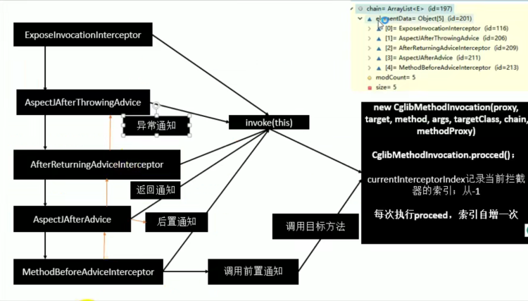

### AOP总结

1)、@EnableAspectJAutoProxy 开启AOP功能

2)、@EnableAspectJAutoProxy 会给容器中注册一个组件AnnotationAwareAspectJAutoProxyCreator

3)、AnnotationAwareAspectJAutoProxyCreator是一 个后置处理器;

4)、容器的创建流程: 

1)、registerBeanPostProcessors()注册后置处理器；创建AnnotationAwareAspectJAutoProxyCreator

2)、finishBeanFactoryInitialization() 初始化剩下的单实例bean

1)、创建业务逻辑组件和切面组件

2)、AnnotationAwareAspectJAutoProxyCreator拦截组件的创建过程

3)、组件创建完之后，判断组件是否需要增强。如果是:切面的通知方法，包装成增强器(Advisor) ;给业务逻辑组件创建一 个代理对象（cglib）


5)、执行目标方法:

1)、代理对象执行目标方法

2)、CglibAopProxy.intercept( ) 进行拦截

1)、得到目标方法的拦截器链(增强器)

2)、利用拦截器的链式机制，依次进入每一个拦截器进行执行;

3)、效果:

正常执行:前置通知-》目标方法-》后置通知-》返回通知

出现异常:前置通知-》目标方法-》后置通知-》异常通知


## 十六、声明式事务

1、导入相关依赖

```xml
<dependency>
    <groupId>c3p0</groupId>
    <artifactId>c3p0</artifactId>
    <version>0.9.1.2</version>
</dependency>
<dependency>
    <groupId>mysql</groupId>
    <artifactId>mysql-connector-java</artifactId>
    <version>5.1.49</version>
</dependency>
<dependency>
    <groupId>org.springframework</groupId>
    <artifactId>spring-jdbc</artifactId>
    <version>4.3.12.RELEASE</version>
</dependency>
<dependency>
    <groupId>org.springframework</groupId>
    <artifactId>spring-orm</artifactId>
    <version>4.3.12.RELEASE</version>
</dependency>
```


创建新的Service、Dao

```java
@Service
public class UserService {

    @Autowired
    private UserDao userDao;

    public void insert(){
        userDao.insert();
    }

}
```

```java
@Repository
public class UserDao {

    @Autowired
    private JdbcTemplate jdbcTemplate;

    public void insert(){
        String sql = "insert into `t_user`(username,age) value(?,?)";
        String name = UUID.randomUUID().toString().substring(0,5);
        jdbcTemplate.update(sql,name,19);
    }
}
```

配置类

```java

@ComponentScan("com.xiaotu.tx")
@PropertySource("classpath:/jdbc_config.properties")
@Configuration
@EnableTransactionManagement
public class TxConfig {

    @Value("${db.username}")
    private String user;

    @Value("${db.password}")
    private String password;

    @Value("${db.driverClass}")
    private String driverClass;

    @Value("${db.url}")
    private String url;

    @Bean
    public DataSource dataSource() throws PropertyVetoException {
        ComboPooledDataSource dataSource = new ComboPooledDataSource();
        dataSource.setUser(user);
        dataSource.setPassword(password);
        dataSource.setJdbcUrl(url);
        dataSource.setDriverClass(driverClass);
        return dataSource;
    }

    @Bean
    public JdbcTemplate jdbcTemplate(DataSource dataSource){
        JdbcTemplate jdbcTemplate = new JdbcTemplate(dataSource);
        return jdbcTemplate;
    }


    //注册事务管理器在容器中
    @Bean
    public PlatformTransactionManager transactionManager(DataSource dataSource){
        return new DataSourceTransactionManager(dataSource);
    }

}
```

测试方法

```java
@Test
public void test(){
    AnnotationConfigApplicationContext applicationContext = new AnnotationConfigApplicationContext(TxConfig.class);
    UserService userService = applicationContext.getBean(UserService.class);
    userService.insert();
}
```


1. 给方法上标注@Transactional表示当前方法是一个事务方法; 
2. @EnableTransactionManagement 开启基于注解的事务管理功能;
3. 配置事务管理器来控制事务: public PlatformTransactionManager transactionManager(DataSource dataSource)


### 事务原理


原理:

1)、@EnableTransactionManagement利用@Import({TransactionManagementConfigurationSelector.**class**}) 导入TransactionManagementConfiguration**Selector**，然后给容器中导入组件

导入两个组件：AutoProxyRegistrar、ProxyTransactionManagementConfiguration

2)、AutoProxyRegistrar  

给容器中注册一个InfrastructureAdvisorAutoProxyCreator（也是一个后置处理器）组件

InfrastructureAdvisorAutoProxyCreator 是利用后置处理器机制在对象创建以后【实例化之后，初始化之前】，包装对象，返回一个代理对象(增强器)，代理对象执行方法利用拦截器链进行调用;

3)、ProxyTransactionManagementConfiguration

1、给容器中注册事务增强器;

1)、事务增强器要用事务注解的信息，AnnotationTransactionAttributeSource解析事务注解

2)、事务拦截器:

TransactionInterceptor;保存了事务属性信息，事务管理器;

他是一个MethodInterceptor;

在目标方法执行的时候 ，执行拦截器链;

事务拦截器:

1)、先获取事务相关的属性

2)、再获取PlatformTransactionManager，如果事先没有添加指定任何transactionManager，最终会从容器中按照类型获取一个PlatformTransactionManager。

3)、执行目标方法 

如果异常，获取到事务管理器，利用事务管理回滚操作;

如果正常，利用事务管理器，提交事务


