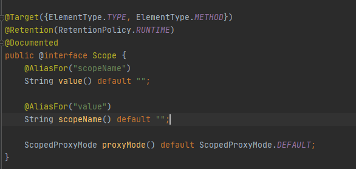

# Spring 注解驱动开发

## 一、简介


整个专栏分成了三个大的部分，分别是：容器、扩展原理以及Web。

###  1.1 容器

容器作为整个专栏的第一大部分，内容包括：

- AnnotationConfigApplicationContext
- 组件添加
- 组件赋值
- 组件注入
- AOP
- 声明式事务


### 2.1 扩展原理

扩展原理作为整个专栏的第二大部分，内容包括：

- BeanFactoryPostProcessor
- BeanDefinitionRegistryPostProcessor
- ApplicationListener
- Spring容器创建过程

在这部分，我们会一起来研究一下Spring的底层源码和运行流程，对于很多小伙伴来说，这部分的内容相当枯燥，甚至有种身体被掏空的感觉（哈哈），但是，这部分的内容一定要掌握，记住是一定要掌握哟😊，因为这是普通程序员进阶成为高级程序员的必经之路。

这部分内容对于深度学习Spring框架，起着非常重要的作用。小伙伴们在看这部分的文章时，一定要根据文章自己多动手调试调试Spring源码，这样对于Spring的理解才能更加深刻。

### 1.3 Web

Web作为整个专栏的第三大部分，内容包括：

- servlet3.0
- 异步请求


## 二、Bean

### 2.1 Spring IOC和DI

在Spring容器的底层，最重要的功能就是IOC和DI，也就是控制反转和依赖注入。


DI和IOC它俩之间的关系是DI不能单独存在，DI需要在IOC的基础上来完成。

在Spring内部，所有的组件都会放到IOC容器中，组件之间的关系通过IOC容器来自动装配，也就是我们所说的依赖注入。接下来，我们就使用注解的方式来完成容器中组件的注册、管理及依赖、注入等功能。

在介绍使用注解完成容器中组件的注册、管理及依赖、注入等功能之前，我们先来看看使用XML配置文件是如何注入bean的。

###  2.2 通过XML配置文件注入JavaBean

添加pom依赖包

```xml
<!-- https://mvnrepository.com/artifact/org.springframework/spring-context -->
<dependency>
    <groupId>org.springframework</groupId>
    <artifactId>spring-context</artifactId>
    <version>5.2.22.RELEASE</version>
</dependency>
```

创建bean下的People类

```java
public class Person {

    private String name;
    private Integer age;

    public Person(String name, Integer age) {
        this.name = name;
        this.age = age;
    }

    public Person() {
    }

    public String getName() {
        return name;
    }

    public void setName(String name) {
        this.name = name;
    }

    public Integer getAge() {
        return age;
    }

    public void setAge(Integer age) {
        this.age = age;
    }

    @Override
    public String toString() {
        return "Person{" +
                "name='" + name + '\'' +
                ", age=" + age +
                '}';
    }
}
```

在默认resource目录下创建Spring配置文件 beans.xml

```xml
<?xml version="1.0" encoding="UTF-8"?>
<beans xmlns="http://www.springframework.org/schema/beans"
       xmlns:xsi="http://www.w3.org/2001/XMLSchema-instance"
       xsi:schemaLocation="http://www.springframework.org/schema/beans http://www.springframework.org/schema/beans/spring-beans.xsd">

        <bean id="person" class="com.xiaotu.bean.Person">
            <property name="name" value="小土"></property>
            <property name="age" value="18"></property>
        </bean>
</beans>
```

随手创建一个测试类

```java
ApplicationContext applicationContext = new ClassPathXmlApplicationContext("beans.xml");
Person person = (Person)applicationContext.getBean("person");
System.out.println(person);
```

### 2.3 通过注解的方式注入JavaBean

在config下创建配置类 MainConfig

```java
@Configuration //告诉Spring这事一个配置类
public class MainConfig {

    //给容器注册一个Bean 类型返回值的类型 id默认方法名
    @Bean
    public Person person1(){
        return new Person("xiaotu2",20);
    }

}
```

测试类加载注解类

```java
ApplicationContext applicationContext = new AnnotationConfigApplicationContext(MainConfig.class);
Person person = applicationContext.getBean(Person.class);
System.out.println(person);
```

### 2.4 IOC容器中Bean的名字

- xml配置则为定义的id值

- java配置类则为@Bean注解下标识的方法名，若Bean注解有值，则为配置的值

```java
String[] name4Type = applicationContext.getBeanDefinitionNames();
for ( String name:name4Type){
	System.out.println(name);
}
```


## 三、ComponentScan

### 3.1 XML文件扫描

```xml
<!--只要在com.xiaotu包下，或者com.meimeixia的子包下标注了@Repository、@Service、@Controller、@Component注解的类都会被扫描到，并自动注入到Spring容器中-->
<context:component-scan base-package="com.xiaotu"></context:component-scan>
```

新增BookController,BookService,BookDao文件，添加junit依赖

```java
@Test
public void testScan(){
    ApplicationContext applicationContext = new ClassPathXmlApplicationContext("beans.xml");
    String[] definitionNames = applicationContext.getBeanDefinitionNames();
    for ( String name:definitionNames){
        System.out.println(name);
    }
}
```


### 3.2 配置类注解扫描

```java
@ComponentScan(value = "com.xiaotu")
@Configuration //告诉Spring这事一个配置类
public class MainConfig {

    //给容器注册一个Bean 类型返回值的类型 id默认方法名
    //@Bean("person002")
    @Bean
    public Person person(){
        return new Person("xiaotu2",20);
    }

}
```


### 3.3 关于@ComponetScan注解

```java
ComponentScan.Filter[] includeFilters() default {};

ComponentScan.Filter[] excludeFilters() default {};
```

- excludeFilters 扫描时应该排除的类
- includeFilters 只扫描包含注解标注的类

```java
@ComponentScan(
        value = "com.xiaotu",
        excludeFilters = {
                @Filter( type = FilterType.ANNOTATION,classes = { Controller.class } ),
                @Filter( type = FilterType.ASSIGNABLE_TYPE , classes = { BookDao.class }),
        } )
```


配置includeFilters 并没有生效，需要增加useDefaultFilters = false 

```
@ComponentScan(
        value = "com.xiaotu",
        includeFilters = { @Filter( type = FilterType.ANNOTATION,classes = { Service.class } )},
        useDefaultFilters = false 
)
```

### 3.4 重复注解

```java
@ComponentScan(
        value = "com.xiaotu",
        includeFilters = { @Filter( type = FilterType.ANNOTATION,classes = { Service.class } )},
        useDefaultFilters = false
)
@ComponentScan(
        value = "com.xiaotu",
        includeFilters = { @Filter( type = FilterType.ANNOTATION,classes = { Controller.class } )},
        useDefaultFilters = false
)
```


## 四、自定义的TypeFilter


### 4.1 ANNOTATION

FilterType.ANNOTATION :按照注解进行包含或者排除

```java
@ComponentScan(
        value = "com.xiaotu",
        includeFilters = { @Filter( type = FilterType.ANNOTATION,classes = { Controller.class } )},
        useDefaultFilters = false
)
```


### 4.2 ASSIGNABLE_TYPE

FilterType.ASSIGNABLE_TYPE：按照给定的类型进行包含或者排除

```java
@ComponentScan(
        value = "com.xiaotu",
        includeFilters = { @Filter( type = FilterType.ASSIGNABLE_TYPE ,classes = {BookService.class} )  },
        useDefaultFilters = false
)
```


### 4.3 ASPECTJ

FilterType.ASPECTJ：按照ASPECTJ表达式进行包含或者排除

```java
@ComponentScan(
        value = "com.xiaotu",
        includeFilters = { @Filter( type = FilterType.ASPECTJ,classes = AspectJTypeFilter.class) },
        useDefaultFilters = false
)
```


### 4.4 REGEX

FilterType.REGEX：按照正则表达式进行包含或者排除

```java
@ComponentScan(
        value = "com.xiaotu",
        includeFilters = { @Filter( type = FilterType.ASPECTJ,classes = AspectJTypeFilter.class) },
        useDefaultFilters = false
)
```


### 4.5 CUSTOM

 FilterType.CUSTOM：按照自定义规则进行包含或者排除，必须为org.springframework.core.type.filter.TypeFilter接口的实现类


```java
public class MyTypeFilter implements TypeFilter {
    /**
     * 参数：
     * metadataReader:读取到的当前正在扫描的类的信息
     * metadataReaderFactory:可以获取到其他任何类的信息的（工厂）
     * */
    @Override
    public boolean match(MetadataReader metadataReader, MetadataReaderFactory metadataReaderFactory) throws IOException {
        return false;
    }

}
```


```java
@ComponentScan(
        value = "com.xiaotu",
        includeFilters = { @Filter( type = FilterType.CUSTOM,classes = MyTypeFilter.class) },
        useDefaultFilters = false
)
```


### 4.6 实现自定义过滤规则

```java
public class MyTypeFilter implements TypeFilter {
    /**
     * 参数：
     * metadataReader:读取到的当前正在扫描的类的信息
     * metadataReaderFactory:可以获取到其他任何类的信息的（工厂）
     * */
    @Override
    public boolean match(MetadataReader metadataReader, MetadataReaderFactory metadataReaderFactory) throws IOException {
        // 获取当前类注解的信息
        AnnotationMetadata annotationMetadata = metadataReader.getAnnotationMetadata();
        // 获取当前正在扫描的类的类信息 比如他的类型 实现的接口
        ClassMetadata classMetadata = metadataReader.getClassMetadata();
        // 获取当前类的资源信息 类的路径等信息
        Resource resource = metadataReader.getResource();
        // 获取正在扫描的类名
        String className =  classMetadata.getClassName();

        System.out.println("====>"+ className);
//        System.out.println("====>"+ annotationMetadata);
//        System.out.println("====>"+ classMetadata);
//        System.out.println("====>"+ resource);
        if (className.contains("er")){
            return true;
        }
        return false;
    }
}
```


## 五、@Scope注解

### 5.1 @注解概述




- ConfigurableBeanFactory#SCOPE_PROTOTYPE
- ConfigurableBeanFactory#SCOPE_SINGLETON
- org.springframework.web.context.WebApplicationContext#SCOPE_REQUEST
- org.springframework.web.context.WebApplicationContext#SCOPE_SESSION


request和session的作用域需要web环境，也可以通过

```
request.setAttribute("key",Object);

session.setAttribute("key",Object);
```


### 5.2 单实例bean作用域

com.xiaotu.config包下创建一个配置类，例如MainConfig2，然后在该配置类中实例化一个Person对象，并将其放置在Spring容器中，如下所示。

```java
@Configuration
public class MainConfig2 {

    @Bean
    public Person person(){
        return new Person("theodore",18);
    }
}
```


IOCTest增加新的测试方法

```java
@SuppressWarnings("resource")
@Test
public void test02(){
    AnnotationConfigApplicationContext applicationContext = new AnnotationConfigApplicationContext(MainConfig2.class);

    //IOC默认的bean管理都是单例的，获取多次为同一个单例对象
    Person person = (Person) applicationContext.getBean("person");
    Person person2 = (Person) applicationContext.getBean("person");
    System.out.println(person == person2);
}
```

**对象在Spring容器中默认是单实例的，Spring容器在启动时就会将实例对象加载到Spring容器中，之后，每次从Spring容器中获取实例对象，都是直接将对象返回，而不必再创建新的实例对象了**。

### 5.3 多实例的bean作用域

修改bean作用域

```java
@Configuration
public class MainConfig2 {

    @Scope("prototype")
    @Bean
    public Person person(){
        return new Person("theodore",18);
    }
}
```


xml方式

```xml
<bean id="person" class="com.xiaotu.bean.Person" scope="prototype">
    <property name="name" value="小土"></property>
    <property name="age" value="18"></property>
</bean>
```

IOCTest中的test02返回false。


### 5.4 单实例bean作用域何时创建对象

去掉 ` @Scope("prototype")`， person实例化前增加打印`System.out.println("给容器中添加person对象");`

```java
@Test
public void test03(){
    AnnotationConfigApplicationContext applicationContext = new AnnotationConfigApplicationContext(MainConfig2.class);

}
```

运行test03发现打印代码，说明Spring容器在创建的时候，就将@Scope注解标注为singleton的组件进行了实例化，并加载到了Spring容器中。


### 5.5 多实例bean作用域何时创建对象

恢复 ` @Scope("prototype")`,运行test03，没有打印日志。在test03中添加获取bean。

```java
@Test
public void test03(){
    AnnotationConfigApplicationContext applicationContext = new AnnotationConfigApplicationContext(MainConfig2.class);
    Person person = (Person) applicationContext.getBean("person");

}
```

再次运行，出现了打印日志。


```java
@Test
public void test03(){
    AnnotationConfigApplicationContext applicationContext = new AnnotationConfigApplicationContext(MainConfig2.class);
    Person person = (Person) applicationContext.getBean("person");
    Person person2 = (Person) applicationContext.getBean("person");
    System.out.println(person == person2);
}
```

获取多个实例，两个实例并不相等

每次向Spring容器获取对象时，它都会创建一个新的对象并返回。


### 5.6 注意事项

**单实例bean是整个应用所共享的，所以需要考虑到线程安全问题，之前在玩SpringMVC的时候，SpringMVC中的Controller默认是单例的，有些开发者在Controller中创建了一些变量，那么这些变量实际上就变成共享的了，Controller又可能会被很多线程同时访问，这些线程并发去修改Controller中的共享变量，此时很有可能会出现数据错乱的问题，所以使用的时候需要特别注意。**

**多实例bean每次获取的时候都会重新创建，如果这个bean比较复杂，创建时间比较长，那么就会影响系统的性能，因此这个地方需要注意点。**


### 5.7 自定义Scope

- Scope源码


- 将自定义Scope注册到容器中。此时，需要调用org.springframework.beans.factory.config.ConfigurableBeanFactory#registerScope这个方法，咱们看一下这个方法的声明


- 使用自定义的作用域。也就是在定义bean的时候，指定bean的scope属性为自定义的作用域名称

### 5.8 自定义Scope的实现案例

实现一个线程级别的bean作用域，同一个线程中同名的bean是同一个实例，不同的线程中的bean是不同的实例。

```java
public class ThreadScope implements Scope {
    public static final String THREAD_SCOPE = "thread";
    private ThreadLocal<Map<String,Object>> beanMap = new ThreadLocal(){

        @Override
        protected Object initialValue() {
            return super.initialValue();
        }
    };

    /**
    * 返回当前作用域中的name对应的bean对象
    * @param name:需要检索的bean对象的名称
    * @param objectFactory :如果name对应的bean对象在当前作用域没有找到，则可以调用这个objectFactory来创建这个bean对象
    * */
    @Override
    public Object get(String name, ObjectFactory<?> objectFactory) {
        Object bean = beanMap.get().get(name);
        if (Objects.isNull(bean)){
            bean = objectFactory.getObject();
            beanMap.get().put(name,bean);
        }
        return null;
    }

    /**
    * 将name对应的bean对象从当前作用域中移除
    * */
    @Override
    public Object remove(String name) {
        return this.beanMap.get().remove(name);
    }

    /**
    * 用于注册销毁回调，若想要销毁相应的对象,则要由spring容器注册相应的销毁回调，而由自定义的作用域选择是不是要销毁相应的对象
    * */
    @Override
    public void registerDestructionCallback(String name, Runnable callback) {
        System.out.println(name);
    }

    /**
     * 用于解析相应的上下文数据，比如request作用域将返回request中的属性
     * */
    @Override
    public Object resolveContextualObject(String key) {
        return null;
    }

    /**
    *  作用域的会话标识，比如session作用域的会话标识是sessionID
    * */
    @Override
    public String getConversationId() {
        return Thread.currentThread().getName();
    }
}
```


新增MainConfig3

````java
@Configuration
public class MainConfig3 {

    @Scope("thread")
    @Bean("person")
    public Person person(){
        System.out.println("给容器添加person对象");
        return new Person("崔小土",21);
    }
}
````


新增测试方法

```java
@Test
public void test04(){
    AnnotationConfigApplicationContext applicationContext = new AnnotationConfigApplicationContext(MainConfig3.class);
    //向容器中注册自定义的scope
    applicationContext.getBeanFactory().registerScope(ThreadScope.THREAD_SCOPE,new ThreadScope());

    //使用容器获取bean
    for (int i = 0; i < 2; i++) {
        new Thread(()->{
            System.out.println(Thread.currentThread() + "," + applicationContext.getBean("person"));
            System.out.println(Thread.currentThread() + "," + applicationContext.getBean("person"));
        }).start();
    }

    try {
        TimeUnit.SECONDS.sleep(1);
    }catch (Exception e){
        e.printStackTrace();
    }
}
```

测试失败：啊哈哈哈 多线程获取不到bean! 不知道怎么实现的。todo：修复多进程获取bean的问题！！

